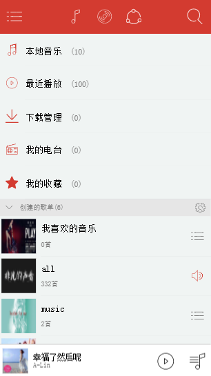
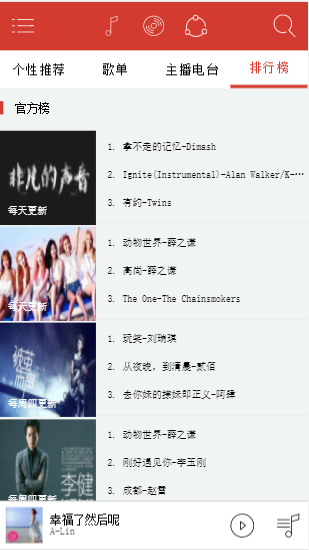
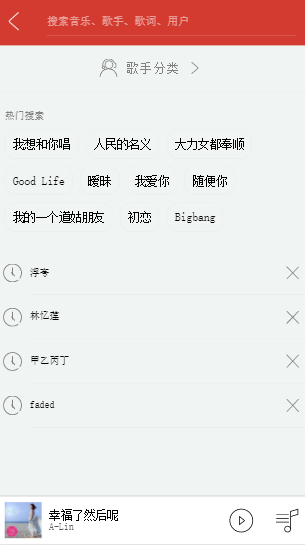

## 基于vue全家桶，仿网易云音乐移动端简版

``` bash
#克隆项目
git clone git@github.com:cmh1996/cloud-music.git

# 安装依赖
npm install

# 本地开发环境 访问http://localhost:8080
npm run dev

# 构建生产
npm run build

```

## 项目说明
该项目是我学习vue时写的第二个练手项目，代码也比较精简。


## 项目截图


